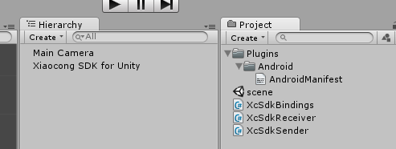
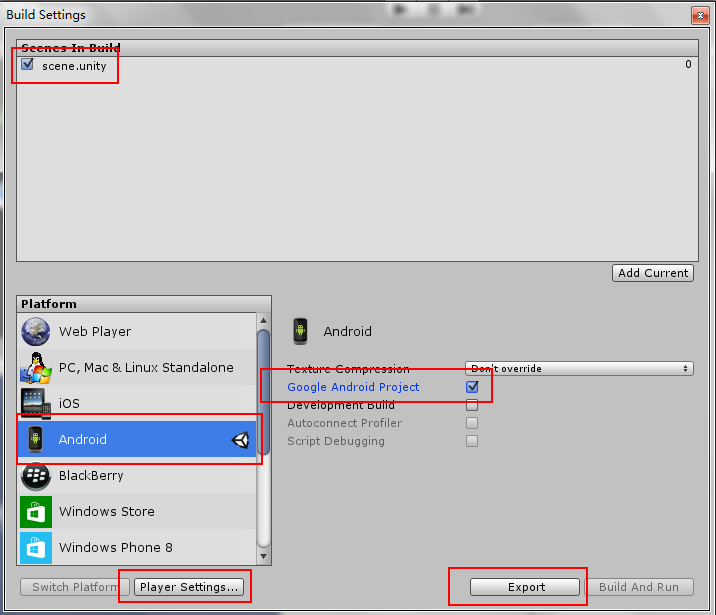
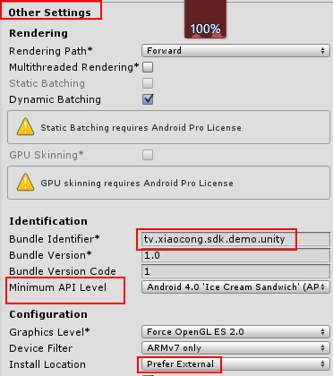
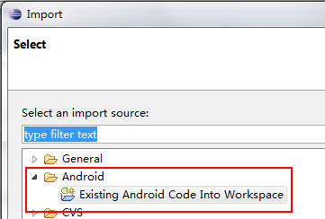
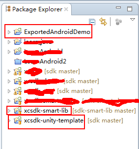
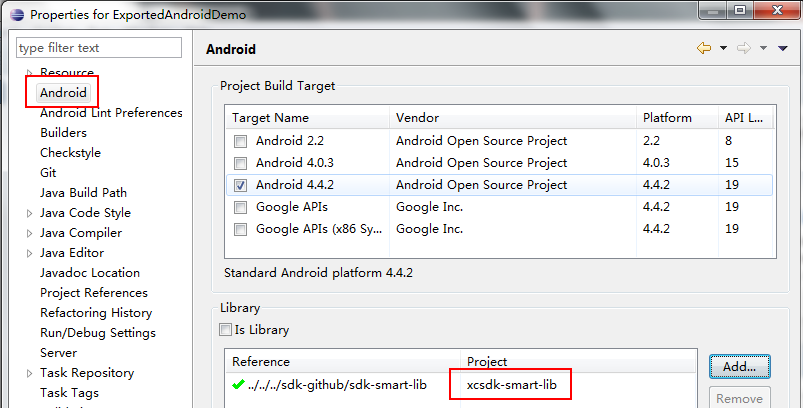

# Unity 集成 SDK 开发指引

本文使用Unity 4.3版本。

Unity产生Android应用有两种方式。一种是在Unity中直接编译产生apk。另一种是先在Unity中导出Android工程，然后利用ADT/Eclipse等工具生成apk。由于第二种方式方便集成Android的各种库和SDK，本文使用第二种方式。

先下载本项目所有文件。其中，`UnityProject`是一个Unity工程。`xcsdk-unity-template`是一个Android工程。

## Unity工程的结构

先在Unity中打开`UnityProject`工程。从下图我们可以看到工程的组成：

`Plugins/Android`目录唯一目是用于导出Android工程。AndroidManifest.xml也很简单，仅仅包含`application`声明。

工程的关键是三个C#文件：`XcSdkBindings.cs`、`XcSdkReceiver.cs`、`XcSdkSender.cs`。

`XcSdkBindings.cs`用于映射C#代码和Java代码。例如映射用户注册功能：

	// for register
	public void register() {
		using (AndroidJavaClass unityPlayer = new AndroidJavaClass ("com.unity3d.player.UnityPlayer")) {
			using (AndroidJavaObject curActivity = unityPlayer.GetStatic<AndroidJavaObject>("currentActivity")) {
				curActivity.Call("register");
			}
		}
	}

后面我们会看到对应的`MainActivity`中有一个public的`register`方法。

`XcSdkSender.cs`用于构建测试界面上的几个按钮。

    if(GUILayout.Button("register", GUILayout.Width(200), GUILayout.Height(100))) {
        XcSdkBindings.Instance.register();
    }

`XcSdkSender.cs`用于接受SDK的回调。

## 导出Android工程

您的C#代码可以参照上述三个cs文件编写。然后与您的游戏功能集成。完成后，接下来我们来导出一个Android工程。

选择菜单**File -> Build Settings...**，会弹出下面的对话框。注意勾选**Google Android Project**然后点击 Export 按钮。注意不要点**Build And Run**，这是直接生成Apk。

在点击 Export 之前，需要先确认一下配置，点击**Player Settings...**。注意Bundle Identifier这一节，必须与你应用的包名相同。

确认无误后，点击 Export 导出工程。选择一个位置存放最后的工程。我们设置的默认工程名是`ExportedAndroidDemo`。

## 导入Android工程

接下来我们把刚才导出的Android工程`ExportedAndroidDemo`与我们的模板`xcsdk-unity-template`导入Eclipse。

我们假设你之前已经导入了我们的[SDK工程](https://github.com/XiaoCongGame/sdk-smart-lib)。

导入后工作空间中将有三个工程。

## 拷贝Android文件

将`xcsdk-unity-template`工程中`src`、`assets`、`res`目录和`AndroidManifest.xml`拷贝到`ExportedAndroidDemo`工程中并覆盖重复文件——如果你的工程比较复杂或需要依赖其他库，你可能需要先修改一下冲突的文件。

## 将SDK工程作为`ExportedAndroidDemo`的依赖

打开`ExportedAndroidDemo`属性，把SDK工程添加到工程的依赖中。

## 运行`ExportedAndroidDemo`

此时Unity Demo已经可以运行了。

